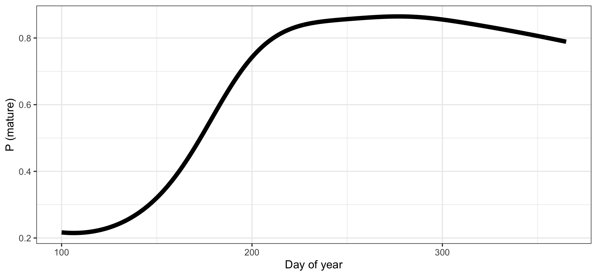

## Request 2 -- "Day of year effect"

The SRG requests a plot of the day effect in the maturity analysis for age-3 hake for any given year, assuming the peak of maturity is the same in all years (please confirm this assumption). 

* The formula used for the non-spatial effects of the maturity-at-age model looks like the following:

`formula <- functional_maturity ~ -1 + s(doy) + age_scaled + I(age_scaled^2) + mean_temp + I(mean_temp^2)`

* where there is **NO** interaction with the smoother on the day of the year. Thus, we would not expect the
shape of the relationship to change with time or temperature in this case.

## Request 2 -- "Day of year effect"
```{r doy-maturity, results = "asis", out.height = "70%"}

```