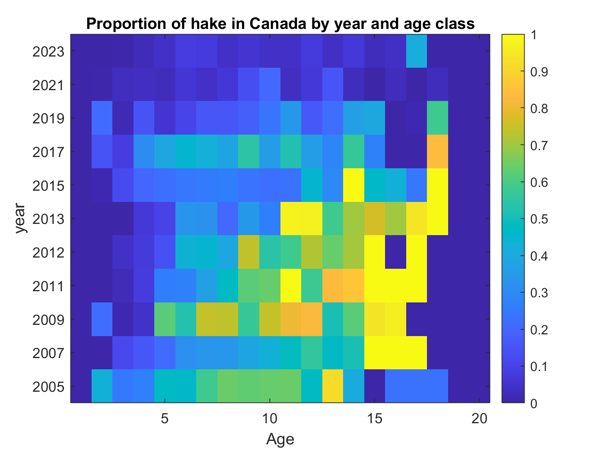

\newpage

\rfoot{SRG requests}

# Scientific Review Group (SRG) requests {#sec:app-srg-requests}

This appendix summarizes results produced in response to Scientific Review
Group requests made during the meeting held from February 6--9, `r assess_yr`.

## Day 1

### Request 1 {-}

List the sample sizes for males, females and unsexed (for the weight-at-age),
for the U.S. and Canada. This will help to understand the effect of averaging
unsexed fish into empirical weight-at-age and provide some insight into the
differences spatially of weight-at-age.

**JTC Response**

The JTC provided two tables, one for each country containing the
weight-at-age sample sizes for each sex code(Male = M, Female = F,
Unsexed = U), by country (Tables~\@ref(tab:srg-weight-at-age-sample-size-can)
and \@ref(tab:srg-weight-at-age-sample-size-us)).

The weight-at-age for two years, 2018 and 2023 are shown in
Figure~\@ref(fig:srg-plot-weight-at-age-by-sex-fig). During the meeting, this plot
contained unsexed fish as well, which were all much heavier than both males and
females. On investigation, the JTC discovered that the data file for Canada
had been modified to have all the sex data set to **U** (unsexed). This was
fixed and Figure~\@ref(fig:srg-plot-weight-at-age-by-sex-fig) shows the result.

```{r srg-weight-at-age-sample-size-can, results = "asis"}
font_size <- 9
temp_waa <- weight_at_age_df |>
  dplyr::group_split(country) |>
  purrr::map_df(\(x) dplyr::group_by(x, country, year, sex, data_type) |>
    dplyr::count() |>
    tidyr::pivot_wider(
      names_sep = " ",
      values_from = n,
      names_from = c(sex, data_type),
      names_sort = TRUE,
      names_vary = "slowest",
      values_fill = 0
    ) |>
    dplyr::select(country, year, dplyr::starts_with(LETTERS))
  ) |>
  ungroup()

temp_waa[is.na(temp_waa)] <- 0
temp_waa <- temp_waa |>
  mutate(across(-c(country, year), ~{f(.x)}))

nms <- names(temp_waa)
nms[nms !=  "country"] <- str_to_title(nms[nms != "country"])
names(temp_waa) <- nms
can_waa <-temp_waa |>
  filter(country == "canada") |>
  select(-country)

kbl(can_waa,
    format = "latex",
    linesep = "",
    align = rep("r", ncol(can_waa)),
    caption = paste0("Canadian sample sizes for weight-at-age ",
                     "data. F = Female, M = Male, and U = Unsexed."),
    booktabs = TRUE) |>
row_spec(0, bold = TRUE) |>
kable_styling(font_size = font_size)
```

\clearpage

```{r srg-weight-at-age-sample-size-us, results = "asis"}

us_waa <-temp_waa |> 
  filter(country == "usa") |>
  select(-country)

kbl(us_waa,
    format = "latex",
    linesep = "",
    align = rep("r", ncol(can_waa)),
    caption = paste0("U.S. sample sizes for weight-at-age ",
                     "data. F = Female, M = Male, and U = Unsexed. Samples ",
                     "from the Poland survey are included in the fisheries ",
                     "data."),
    booktabs = TRUE,
    longtable = TRUE) |>
row_spec(0, bold = TRUE) |>
kable_styling(font_size = font_size,
              latex_options = c("repeat_header"))
```

(ref:srg-plot-weight-at-age-by-sex-cap) Weight-at-age by sex (shapes) for two
fishing years, 2018 and 2023 (colors).

(ref:srg-plot-weight-at-age-by-sex-alt) Weight-at-age was
higher for older fish in 2018 fish than 2023 fish. Females are larger
than the males for all ages in both years.

```{r srg-plot-weight-at-age-by-sex-fig, out.height = "85%",  fig.cap = "(ref:srg-plot-weight-at-age-by-sex-cap)"}

wtaa_preds <- readRDS(fs::path("/srv/hake/other/tv", "weight-at-age-preds.rds"))
# Make figure
wtaa_preds <- wtaa_preds |>
  filter(year %in% c(last_data_yr - 5, last_data_yr)) |>
  rename(Sex = sex, `Fishing year` = fyear) |>
  mutate(Sex = ifelse(Sex == "M",
                      "Male",
                      "Female"))

g <- ggplot(data = wtaa_preds,
            aes(x = age,
                y = est_weight,
                group = interaction(Sex, year),
                colour = `Fishing year`,
                pch = Sex)) +
     ylim(c(0, 1.5)) +
     geom_line() +
     geom_point() +
     xlab("Age (years)") +
     ylab("Estimated mass (kg)")
g
```

(ref:srg-plot-base-v-tv-maturity-ssb-cap) Female spawning biomass for the pre-SRG
base model compared to the final base model, where the latter model excluded
unsexed fish in the weight-at-age data.

(ref:srg-plot-base-v-tv-maturity-ssb-alt) This plot shows that the spawning
biomass for the final base model ends at a much higher level than the model
submitted for review.

```{r srg-plot-base-v-tv-maturity-ssb-fig, out.height = "85%",  fig.cap = "(ref:srg-plot-base-v-tv-maturity-ssb-cap)"}

m_names <- c("Pre-SRG base", "Sexed weight-at-age (new base)")
old_base_model <- readRDS("/srv/hake/models/2024/01-version/01-base-models/01-base/01-base.rds")
plot_biomass(list(old_base_model, base_model), model_names = m_names)
```

(ref:srg-plot-base-v-tv-maturity-rel-cap) Relative female spawning biomass for the
pre-SRG base model compared to the final base model, where the latter model excluded
unsexed fish in the weight-at-age data.

(ref:srg-plot-base-v-tv-maturity-rel-alt) This plot shows that the relative
spawning biomass for the final base model ends at close to B zero.

```{r srg-plot-base-v-tv-maturity-rel-fig, out.height = "85%",  fig.cap = "(ref:srg-plot-base-v-tv-maturity-rel-cap)"}
plot_rel_biomass(list(old_base_model, base_model),
                 model_names = m_names,
                 ylim = c(0, 2.75))
```

### Request 2 {-}

On Figure~\@ref(fig:app-maturity-analysis-temp-marginal-fig) add the data
for proportion mature at age-2 (if possible) and age-3 to the model prediction
of maturity at age-2 (if possible) and age-3 from the temperature-based model.

**JTC Response**

The JTC provided two figures showing the proportion mature by year and
temperature.

* Figure~\@ref(fig:srg-prop-age-2-mature-by-temp-fig) shows empirical results for age two and
  Figure~\@ref(fig:srg-prop-age-3-mature-by-temp-fig) shows
  empirical results for age three. For each year (denoted on the smooth
  line) the points representing the raw data from non-ASHOP samples appear above
  or below the labeled point from the same year.
* We do not expect the points to overlap or lie on the line because the curve
  represents the marginal effect of temperature (e.g., predicted maturity from
  non-ASHOP samples collected from an average sample location on July 1 but
  predicted to the 278th day of the year).
* Changing the reference date from July 1 to a later date for age-3 fish shifted
  the curve up closer to the points because the non-ASHOP samples occur later
  in the year (25% before July1/75% after). The points are also affected by
  variable sampling effort year to year.
* In conclusion, we would never really expect the empirical estimates to
  perfectly match the model-based ones. Sampling varies across space and time,
  and the empirical estimates do not account for any of this variation.

(ref:srg-prop-age-2-mature-by-temp-cap) Proportion of age-2 fish mature by
year and sea temperature (Celcius).

(ref:srg-prop-age-2-mature-by-temp-alt) This figure shows that the proportion
of age-2 fish mature is approximately 0.15 for 2020 and 2018 at a temperature
of 9 degrees Celsius.

```{r srg-prop-age-2-mature-by-temp-fig, results = "asis", out.height = "85%", fig.cap = "(ref:srg-prop-age-2-mature-by-temp-cap)"}
include_graphics(file.path(figures_dir,
                           "2024-srg-response-1-2-a.png"),
                 error = FALSE)
```

(ref:srg-prop-age-3-mature-by-temp-cap) Proportion of age-3 fish mature by
year and sea temperature (Celcius).

(ref:srg-prop-age-3-mature-by-temp-alt) This figure shows that the proportion
of age-3 fish mature is approximately 0.6 for 2020 and 2018 at a temperature
of 9 degrees Celsius.
1
```{r srg-prop-age-3-mature-by-temp-fig, results = "asis", out.height = "85%", fig.cap = "(ref:srg-prop-age-3-mature-by-temp-cap)"}
include_graphics(file.path(figures_dir,
                           "2024-srg-response-1-2-b.png"),
                 error = FALSE)
```
\clearpage

### Request 3 {-}

Add B~2023~/B~0~ to Table~\@ref(tab:main-parameter-estimates-tab) comparing
the 2023 and 2024 assessments.

**JTC Response**

The JTC provided an updated table, and updated the table in the assessment
to match it. See Table~\@ref(tab:main-parameter-estimates-tab). All other
similar tables in the document containing parameter estimates now have this
row as well.

### Request 4 {-}

The SRG requests data to better understand the presence of clean hake trawls
and mixed species trawls in the 2023 acoustic survey by area (such as INPFC
area). This will help understand where hake were in 2023 and the potential
effects of mixed trawls on the determination of biomass.

**JTC Response**

In 2023, the acoustic-trawl survey had 13 regions out of 282 that were
classified as 'hake mix'. These regions were associated with 4 separate
trawls. The hake percentages in those hake mix trawls ranged from 55%
to 76% hake (all mixed with rockfish).

22.9 kt out of the 735 kt of un-Kriged biomass (3.1%) came from hake
mixes in 2023.

### Request 5 {-}

The SRG requests maturity-at-age in a tabular format from 2008 to 2026.
These numbers will help understand the variability of maturity-at-age without
the effect of changes in weight-at-age used to calculate fecundity. It will
also help understand how the projected maturity-at-age relates to estimated
values. 

**JTC Response**

The actual years that are included are 2009--2023 and 4 projection years.
The projections use the mean of the maturity-at-age for 2019--2023.
Figure~\@ref(fig:srg-main-mat-at-age-fig) shows the requested table in
a heatmap format to match the other figures in the document depicting
weight-at-age, sample sizes of weight-at-age, and fecundity.

(ref:srg-main-mat-at-age-cap) Heatmap showing maturity-at-age by year in the
same format as the other heatmaps for weight-at-age, sample size, and
fecundity found in this document (Figures~\@ref(fig:main-weight-at-age-fig)--
\@ref(fig:main-fecundity-at-age-fig)). The Projected years (`r min(forecast_yrs)`--
`r max(forecast_yrs)`) are set to the mean values of the previous 5 years
(`r assess_yr - 5`--`r assess_yr - 1`). The years prior to the initial year
shown (2009) are set to the mean of the entire time series and are shown in
the **Mean** row.

(ref:srg-main-mat-at-age-alt) This figure shows that maturity-at-age can vary
a lot between years.

```{r srg-main-mat-at-age-fig, fig.height = 6, out.height = "70%", fig.cap = "(ref:srg-main-mat-at-age-cap)"}

j <- maturity_estimates_df |>
  filter(model == "Spatial + temperature") |> 
  transmute(Yr = year, age, p_mature) |>
  pivot_wider(names_from = age,
              values_from = p_mature) |> 
  mutate(Seas = 1,
         Sex = 1,
         Bio_pattern = 1,
         BirthSeas = 1,
         Fleet = 1,
         .after = 1)
extra_rows <- j |> slice(1:2)
extra_rows[1, "Yr"] <- 2007
extra_rows[2, "Yr"] <- 2008
j <- bind_rows(extra_rows, j)

# Create projection rows - mean of last 5 years
rows <- tail(j)
mn_row <- rows |>
  colMeans() |>
  vec2df()
for(i in 2024:2027){
  mn_row <- mn_row |> 
    mutate(Yr = i)
  j <- j |> 
    bind_rows(mn_row)
}

j_model <- old_base_model
j_model$wtatage <- j
j_model$startyr <- 2009
j_model$endyr <- 2023
waa_ss_df <- weight_age_sample_sizes_df |> 
  filter(Yr %in% 2009:2023)

plot_heatmap_weight_at_age(
  j_model,
  cell_font_size = 4,
  sample_size_df = waa_ss_df,
  pre_yrs = start_yr_age_comps:old_base_model$endyr,
  pre_func = mean,
  post_yrs = 2024:2027,
  post_wa_vals = j |> select(grep("^[0-9]+$", names(j))) |>
    tail(1) |>
    unlist(),
  #post_func = mean,
  cols = c("red",
           "yellow",
           "green",
           "dodgerblue"))
```

### Request 6 {-}

The SRG requests that the JTC add a new run seriously downweighting the age
composition sample sizes to increase the influence of the survey biomass
index. For example, an effective sample size of no more than 50, which would
mean dividing the sample size by about 100. Alternatively, use a lambda
of 0.05 on survey and fishery age composition data. Report the additional
survey variance as well.

**JTC Response**

A lambda value of 0.05 was multiplied by the age-composition likelihood
component to calculate the overall negative log likelihood to be minimized.
The bulleted list below provides parameter estimates for the base model and
the requested model run, respectively.
Figures~\@ref(fig:srg-plot-sur-fit-base-v-lambda-ssb-fig)--\@ref(fig:srg-plot-recabs-base-v-lambda-ssb-fig)
were provided to the SRG to fulfill the request thoroughly.

* DM fishery: 0.341 (base); 0.035 (lambda)
* DM survey: 0.942; 0.271
* DM ratio: 0.362; 0.129
* Extra SD survey: 0.313; 0.202
* Extra SD age-1 index: 0.385; 0.371
* Age Likelihood: 2,144; 131
* Approximate run time: 2 hours; 17 hours

(ref:srg-plot-sur-fit-base-v-lambda-ssb-cap) Fits to the acoustic age 2$+$
survey observations (triangles) for the base model (black) and the adjusted
lambda = 0.05 model (red).

(ref:srg-plot-sur-fit-base-v-lambda-ssb-alt) This figure shows that the
model with a lambda value of 0.05 fits the 2023 survey index point better than
the base model.

```{r srg-plot-sur-fit-base-v-lambda-ssb-fig, eval = TRUE,fig.height = 4, out.height = "80%", fig.cap = "(ref:srg-plot-sur-fit-base-v-lambda-ssb-cap)"}
m_names <- c("pre-SRG base", "lambda 0.05")
lambda_model <- readRDS("/srv/hake/models/2024/01-version/05-test-models/30-lambda-comps/30-lambda-comps.rds")
plot_survey_index_fits(old_base_model,
                       model_lst=list(old_base_model, lambda_model),
                       model_names = m_names,
                       survey_type = "age2",
                       rev_colors = TRUE,
                       leg_pos = c(0.75, 0.15),
                       xlim = c(1995, end_yr))
```

(ref:srg-plot-age1-fit-base-v-lambda-ssb-cap) Fits to the relative age 1 index
observations (triangles) for the base model (black) and the adjusted
lambda = 0.05 model (red).

(ref:srg-plot-age1-fit-base-v-lambda-ssb-alt) This figure shows that the
model with a lambda value of 0.05 fits the 2023 age 1 index point a little
better than the base model.

```{r srg-plot-age1-fit-base-v-lambda-ssb-fig, eval = TRUE,fig.height = 4, out.height = "80%", fig.cap = "(ref:srg-plot-age1-fit-base-v-lambda-ssb-cap)"}
plot_survey_index_fits(old_base_model,
                       model_lst=list(base_model, lambda_model),
                       model_names = m_names,
                       survey_type = "age1",
                       xlim = c(1995, end_yr),
                       ylim = c(0, 11),
                       leg_ncol = 2,
                       leg_font_size = 10,
                       leg_pos = c(0.25, 0.9),
                       y_breaks = seq(0, 11, by = 2),
                       rev_colors = TRUE)
```

(ref:srg-plot-base-v-lambda-ssb-cap) Estimated female spawning biomass
for the base model (black) and the adjusted lambda = 0.05 model (red). The shaded areas
represent the 95% credible interval.

(ref:srg-plot-base-v-lambda-ssb-alt) This figure shows that the
model with a lambda value of 0.05 has a much higher overall estimated median
biomass and an enormous credible interval when compared to the base model.

```{r srg-plot-base-v-lambda-ssb-fig, eval = TRUE,fig.height = 4, out.height = "80%", fig.cap = "(ref:srg-plot-base-v-lambda-ssb-cap)"}
plot_biomass(list(old_base_model, lambda_model),
             model_names = m_names,
             ylim = c(0, 12),
             point_shape = ts_single_model_pointshape,
             leg_pos = c(0.75, 0.9))
```

(ref:srg-plot-rel-base-v-lambda-ssb-cap) Estimated relative female spawning biomass
for the base model (black) and the adjusted lambda = 0.05 model (red). The shaded areas
represent the 95% credible interval.

(ref:srg-plot-rel-base-v-lambda-ssb-alt) This figure shows that the
model with a lambda value of 0.05 has a much higher overall estimated median
relative biomass and a larger credible interval when compared to the
base model.

```{r srg-plot-rel-base-v-lambda-ssb-fig, eval = TRUE,fig.height = 4, out.height = "80%", fig.cap = "(ref:srg-plot-rel-base-v-lambda-ssb-cap)"}
plot_rel_biomass(list(old_base_model, lambda_model),
                 model_names = m_names,
                 ylim = c(0, 2.5),
                 alpha = 0.2,
                 point_shape = ts_single_model_pointshape,
             leg_pos = c(0.75, 0.9)) |>
  suppressWarnings()
```

(ref:srg-plot-rec-base-v-lambda-ssb-cap) Estimated recruitment deviations
for the base model (black) and the adjusted lambda = 0.05 model (red). The bars represent
the 95% credible interval.

(ref:srg-plot-rec-base-v-lambda-ssb-alt) This figure shows that the
model with a lambda value of 0.05 has much larger overall credible intervals
when compared to the base model.

```{r srg-plot-rec-base-v-lambda-ssb-fig, eval = TRUE,fig.height = 4, out.height = "80%", fig.cap = "(ref:srg-plot-rec-base-v-lambda-ssb-cap)"}
plot_recdevs(list(old_base_model, lambda_model),
             model_names = m_names,
             line_color = ts_single_line_color,
             leg_pos = c(0.25, 0.95))
```

(ref:srg-plot-recabs-base-v-lambda-ssb-cap) Estimated absolute recruitment
for the base model (black) and the adjusted lambda = 0.05 model (red). The bars represent
the 95% credible interval.

(ref:srg-plot-recabs-base-v-lambda-ssb-alt) This figure shows that the
model with a lambda value of 0.05 has much larger overall credible intervals
when compared to the base model.

```{r srg-plot-recabs-base-v-lambda-ssb-fig, eval = TRUE,fig.height = 4, out.height = "80%", fig.cap =  "(ref:srg-plot-recabs-base-v-lambda-ssb-cap)"}
plot_recruitment(list(old_base_model, lambda_model),
                 model_names = m_names,
                 inc_means = TRUE,
                 leg_pos = c(0.25, 0.95)) |>
  suppressWarnings()
```

### Request 7 {-}

The SRG would like to see the proportion of survey biomass and catch
estimated in Canada.

**JTC Response**

The JTC provided two tables to show the catch-at-age in each country,
which were calculated by multiplying the input proportions-at-age with
the the annual catch in each country
(Tables~\@ref(tab:srg-can-catch-at-age-tab) and
\@ref(tab:srg-us-catch-at-age-tab)).

To show the proportion of biomass in Canada as determined by the acoustic
survey, a figure (Figure~\@ref(fig:srg-can-prop-survey-biomass-fig))
and two tables (Tables~\@ref(tab:srg-survey-at-age-can-tab) and
\@ref(tab:srg-survey-at-age-us-tab)) were provided.

```{r srg-can-catch-at-age-tab, results = "asis"}

table_catch_by_fleet(country = 1,
                     caption = "Fishery catch-at-age for Canada (t).",
                     font_size = 7)
```

```{r srg-us-catch-at-age-tab, results = "asis", echo = FALSE}

table_catch_by_fleet(country = 2,
                     caption = "Fishery catch-at-age for U.S.A. (t).",
                     font_size = 6)
```

(ref:srg-can-prop-survey-biomass-cap) The proportion of `r sp` in Canadian
waters by year and age. The yellow tiles mean that all the fish at that
age were found in the Canadian part of the survey only. Dark blue means that
all fish of that age were found in the U.S. part of the survey only, or
for ages 19 and 20, that there were no data.

(ref:srg-can-prop-survey-biomass-alt) This figure shows that fish over age 15
are found almost exclusively in Canada and under age 10 mostly in the U.S.A.

```{r, srg-can-prop-survey-biomass-fig, results = "asis", out.height="80%", fig.cap = "(ref:srg-can-prop-survey-biomass-cap)"}


```

```{r, can-survey-biomass-at-age-load, echo = FALSE}

survey_biomass_at_age_can <- read_csv("../beamer/srg/requests-1/survey-biomass-files/Survey_Biomass_at_Age_CAN.csv")
survey_biomass_at_age_us <- read_csv("../beamer/srg/requests-1/survey-biomass-files/Survey_Biomass_at_Age_US.csv")
```


\clearpage

BEGIN LANDSCAPE

```{r, srg-survey-at-age-us-tab, results = "asis"}

d <- read_csv("../beamer/srg/requests-1/survey-biomass-files/Survey_Biomass_at_Age_US.csv",
              col_types = cols()) |> 
  rename(wgt = wgt_total) |> 
  mutate(across(-year, ~{f(.x / 1e3)})) |> 
  rename(Year = year,
         Biomass = wgt)

kbl(d,
    format = "latex",
    booktabs = TRUE,
    align = c("l",
              rep("r", ncol(d) - 1)),
    linesep = "",
    caption = "Proportion of survey biomass estimated in the U.S.A.",
    escape = FALSE) |>
  kable_styling(font_size = 7) |>
  row_spec(0, bold = TRUE)
```

```{r, srg-survey-at-age-can-tab, results = "asis"}

d <- read_csv("../beamer/srg/requests-1/survey-biomass-files/Survey_Biomass_at_Age_CAN.csv",
              col_types = cols()) |> 
  rename(wgt = wgt_total) |> 
  mutate(across(-year, ~{f(.x / 1e3)})) |> 
  rename(Year = year,
         Biomass = wgt)

kbl(d,
    format = "latex",
    booktabs = TRUE,
    align = c("l",
              rep("r", ncol(d) - 1)),
    linesep = "",
    caption = "Proportion of survey biomass estimated in Canada",
    escape = FALSE) |>
  kable_styling(font_size = 8) |>
  row_spec(0, bold = TRUE)
```

END LANDSCAPE

## Day 2

### Request 1 {-}

The SRG requests rerunning the GLM for weight-at-age without unsexed hake,
and creating a weight-at-age matrix using the updated outputs by averaging
Males and Females equally. 

**JTC Response**

* The GLMM was run after filtering the data to remove sex.

* The model output was truncated to just produce males and females given
  unsexed fish were no longer in the data used to fit the GLMM.
  
* Results for males and females were averaged.

* The weight-at-age file for SS3 was updated.

* The updated weight-at-age file was used to process the fishery-composition
  data.

### Request 2 {-}

The SRG requests a plot of the day effect in the maturity analysis for age-3
hake for any given year, assuming the peak of maturity is the same in all
years (please confirm this assumption). 

**JTC Response**

The formula used for the non-spatial effects of the maturity-at-age model
looks like the following:

$formula <- functional_{maturity} \sim -1 + s(doy) + age_{scaled} + I(age_{scaled}^2) + mean_{temp} + I(mean_{temp}^2)$

where there is **NO** interaction with the smoother on the day of the year.
Thus, we would not expect the shape of the relationship to change with time
or temperature in this case.

(ref:srg-doy-maturity-cap) Proportion of mature fish by day of year.

(ref:srg-doy-maturity-alt) This figure shows an continual rise in proportion
mature from day 100 to day 278 and that by day 210 at least 80 percent of
hake are mature.

```{r srg-doy-maturity-fig, results = "asis", out.height = "70%", fig.cap = "(ref:srg-doy-maturity-cap)"}

include_graphics(here("doc", figures_dir, "maturity_spline_doy.png"))
```

### Request 3 {-}

The SRG requests that the maturity plot be recalculated for Day 278, peak
of maturity.

**JTC Response**

The new figure was presented at the meeting and is now incorporated as part
of the assessment document (Figure~\@ref(main-maturity-ogive-fig)).

### Request 4 {-}

The SRG asks for a presentation of the recalculated probability mature by
age matrix.

**JTC Response**

The JTC created a heatmap-type plot
(Figure~\@ref(fig:srg-main-mat-at-age-heatmap-fig)) which is similar to
the figures in the document for weight-at-age and fecundity-at-age.

(ref:srg-main-mat-at-age-heatmap-cap) Heatmap showing the maturity-at-age by
year. Projected years (2024--2027) are the means of the previous five years
(2019--2023). Values used for years prior to 2009 are the means or the values
by age for 2009--2023.

(ref:srg-main-mat-at-age-heatmap-alt) This figure is a table of tiles with
decimal values representing maturity from 0 to 1. The maturity mostly
increases from ages 2 to 4 and after age 4 values are 1 for most years.

```{r srg-main-mat-at-age-heatmap-fig, fig.height = 6, out.height = "70%", fig.cap = "(ref:srg-main-mat-at-age-heatmap-cap)"}

j <- maturity_estimates_df |>
  filter(model == "Spatial + temperature") |> 
  transmute(Yr = year, age, p_mature) |>
  pivot_wider(names_from = age,
              values_from = p_mature) |> 
  mutate(Seas = 1,
         Sex = 1,
         Bio_pattern = 1,
         BirthSeas = 1,
         Fleet = 1,
         .after = 1)
extra_rows <- j |> slice(1:2)
extra_rows[1, "Yr"] <- 2007
extra_rows[2, "Yr"] <- 2008
j <- bind_rows(extra_rows, j)

# Create projection rows - mean of last 5 years
rows <- tail(j)
mn_row <- rows |>
  colMeans() |>
  vec2df()
for(i in 2024:2027){
  mn_row <- mn_row |> 
    mutate(Yr = i)
  j <- j |> 
    bind_rows(mn_row)
}

j_model <- base_model
j_model$wtatage <- j
j_model$startyr <- 2009
j_model$endyr <- 2023
waa_ss_df <- weight_age_sample_sizes_df |> 
  filter(Yr %in% 2009:2023)

plot_heatmap_weight_at_age(
  j_model,
  cell_font_size = 4,
  sample_size_df = waa_ss_df,
  pre_yrs = start_yr_age_comps:base_model$endyr,
  pre_func = mean,
  post_yrs = 2024:2027,
  post_wa_vals = j |> select(grep("^[0-9]+$", names(j))) |>
    tail(1) |>
    unlist(),
  #post_func = mean,
  cols = c("red",
           "yellow",
           "green",
           "dodgerblue"))
```

## Request 5 {-}

The SRG requests rerunning the base assessment model with updated
weight-at-age and fecundity matrices based on day 278.  Updated harvest
scenario tables if possible.

**JTC Response**

The JTC ran the modified base model and presents the following figures, 

(ref:srg-new-base-biomass-cap) TODO: caption here

(ref:srg-new-base-biomass-alt) TODO: Alt text here

```{r srg-new-base-biomass-fig, out.height = "85%", fig.cap = "(ref:srg-new-base-biomass-cap)"}

m_names <- c("Bridge step",
             "No unsexed weight-at-age",
             "New base",
             "Old base")
pth_01 <- "/srv/hake/models/2024/01-version"
pth_02 <- "/srv/hake/models/2024/02-version"

old_base <-
  readRDS(file.path(pth_01,
                    "01-base-models/01-base/01-base.rds"))
step_before <-
  readRDS(file.path(pth_01,
                    "02-bridging-models/60-survey-1-t-distribution/60-survey-1-t-distribution.rds"))
first_step <-
  readRDS(file.path(pth_02,
                    "05-test-models/01-redo-fishery-comp/01-redo-fishery-comp.rds"))
new_base <-
  readRDS(file.path(pth_02,
                    "01-base-models/01-base/01-base.rds"))

plot_biomass(list(step_before,
                  first_step,
                  new_base,
                  old_base),
             model_names = m_names)
```

