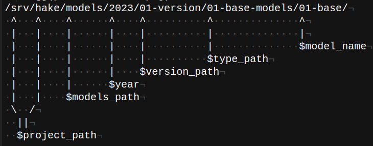

```{r, include = FALSE}
knitr::opts_chunk$set(
  collapse = TRUE,
  comment = "#>"
)
```

```{r setup, echo = FALSE, message = FALSE, results = "hide", warning = FALSE}
library(hake)
```

## Overview of steps to run the models

Running the model for the hake assessment requires several steps. Note that
**ALL** models (base, bridging, sensitivity, retrospective) must:

- be run in MCMC mode (this is done automatically) and
- must be run with the `extra_mcmc` switched on so that a
  `Report_mce_****.sso` file is generated for every posterior. This is set
  with the `run_extra_mcmc` variable in the `BASH` scripts.

The general method in the order in which it typicall should take place
is as follows:

\

**Run base model with forecasting and retrospectives:**

1. Run base model MCMC.
2. Run catch levels for the base model. The catch levels routine has to be
   run prior to forecasting to determine the catch levels to use for
   forecasting for the last three scenarios in the decision tables: the
   default HR, the SPR-100, and the stable catch. The catch levels for these
   are determined using iterative methods. The higher you set the tolerances,
   the longer these will take.
3. Run forecasting for the base model. You can find and change the forecast
   levels in the file `doc/forecast-descriptions.csv`. The forecasts are
   run using the `-mceval` argument to the SS3 executable.
4. Run retrospectives for the base model. There are currently 10 years'
   retrospectives to be run for the base model, and each is run as a full
   MCMC with the extra mcmc output turned on (thousands of Report files
   created for each).
5. Create the base model RDS file which will be read in during the document
   rendering step. There are several sub-steps to this. It was made that way
   to allow for faster and easier debugging.

**Run bridging models:**

1. Run bridging models with full MCMC and extra mcmc output turned on
   (thousands of Report files created for each). You must break these up
   into chunks of models to be run together because each one will have
   multiple chains. For example, if the number of chains per model is 16,
   and the computer has 80 CPUs, you should run a maximum of 4 at once
   which will mean 16 x 4 = 64 CPUs will be used.
   
2. Create the RDS files for each bridging model.

**Run sensitivity models:**

1. Run sensitivity models with full MCMC and extra mcmc output turned on
   (thousands of Report files created for each). You must break these up
   into chunks of models to be run together just as with the bridging
   models.
2. Create the RDS files for each sensitivity model.

## Details of steps to run the base model

### Running the base model using adnuts

1. Open the `bash-scripts/run-base-model.sh` file in an editor.
  
2. Make sure all path variables are correct. The path structure on the
   Linux server with associated variables is as follows. Whichever computer
   you are on, the path structure **MUST** be the same as this:
   
   If on the Linux server, you won't need to change any of the path settings,
   as it is set up for the server. The `$year` is automatically generated.
   It is the current calendar year, unless it is currently December, in which
   case it will be the current year + 1.
3. Make sure the settings for running `adnuts` are correct. They are:
   ```
   ss_exe="ss_2024"
   num_chains=16
   num_samples=8000
   num_warmup_samples=250
   adapt_delta=0.95
   run_extra_mcmc=TRUE
   ```
   The `num_chains` variable is how many CPUs the model will use to run.
   For the other settings, see the `adnuts` documentation. The values shown
   are what we have used for the last few years (2021--2023).
     
3. Open a `BASH` terminal and change directories so you are in the
  `bash-scripts` directory, and execute the run script: `./run-base-model.sh`.
   It will take over an hour to complete.
  
4. If you want to check on the progress of the model run, there are a few
   things you can look at.
   - Watch the `chains` directories being updated. Each chain from 1 to
     what you set `num_chains` to will have its own directory created and
     the model will be running inside each of these in parallel. If you go
     into the `mcmc` directory of the model about 15 minutes after starting,
     you will see all the `chains_**` directories. You can keep listing the
     files in any one of them every 5-10 seconds or so to watch for changing
     file sizes. This is reassuring that everything is proceeding as it
     should. For example, to do this with the base model for 2023 on the
     server in a `BASH` terminal:
     
     ```
     $ cd /srv/hake/models/2023/01-version/01-base-models/01-base/mcmc
     $ ll chain_01
     ```

   - Watch the `chains` directories being removed. Each chain directory is
     removed by `adnuts` after it has completed and its output has been
     copied into the mcmc directory. The chains finish at different times.
     You can keep checking the `mcmc` directory to see them gradually all
     disappear. Once they are all gone, the model run is nearly done. The
     only remaining step is the `-mceval` step which creates a
     `mcmc/sso/Report_mce_****.sso` file for each posterior. To see the
     chain directories disappearing over time:
     
     ```
     $ cd /srv/hake/models/2023/01-version/01-base-models/01-base/mcmc
     $ ll
     ```
   
   - Watch `adaptation.csv` and `unbounded.csv` getting larger as the chain
     information updates it. For example, run the following every 5-10
     seconds to see the file size getting larger:
     
     ```
     $ cd /srv/hake/models/2023/01-version/01-base-models/01-base/mcmc
     $ ll adaptation.csv
     ```
     
   - Watch the process viewer to see each chain working, and watch the
     processes disappear when the chains complete. Open the `htop` viewer
     (Linux) or whatever task manager/process viewer you have access to.
     This example is for `htop`:
     
     ```
     $ htop
     ```
     Once in `htop`, you can single out your own processes by pressing `u`
     followed by typing in your username (or a portion of it). When your
     username is lit up on the left side, press `Enter` and this will
     filter the processes so only yours are shown. You can count the opes
     which represent the R scripts called from the `BASH` scripts. It should
     be obvious which ones they are, as they will be using 100% (or close)
     of the CPU power. You can see each of them disappear from this view when
     its associated chain finishes.
     ```
  
### Running the catch-levels routine and forecasting

1. Open the `bash-scripts/run-forecasts.sh` file in an editor.

2. Make sure all path variables are correct. They must be the same as what
   is in `bash-scripts/run-base-model.sh`.

3. Open a `BASH` terminal and change directories so you are in the
  `bash-scripts` directory, and execute the run script: `./run-forecasts.sh`.
   **This will run fairly quickly on Linux/Mac as it uses multicore process
   forking. This option is not available in Windows so it will take many
   hours if you try to run this from Windows.
   
   - The multicore parallelism for the catch-levels is implemented such that
     each scenario gets its own processor. So there will be three processes
     running that look the same (when using the `htop` process viewer in
     Linux). This will run three times faster on Linux/Mac compared to
     Windows.
     
    - The multicore parallelism for the forecasting is implemented such that
     each catch-level gets its own processor. There are 16 catch level
     scenarios for each forecast year, so 16 CPUs will be used for each
     year, and each forecast year is run one after the other sequentially.
     The catch levels to be forecast for are defined in the file
     `doc/forecast-descriptions.csv`. The forecasting takes a very long time
     on Windows because each catch-level/year case must be run sequentially.
     On Linux/Mac this will run 16 times faster.
     
